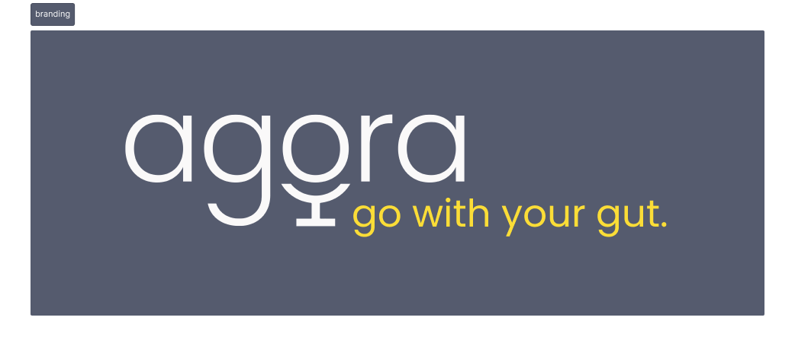
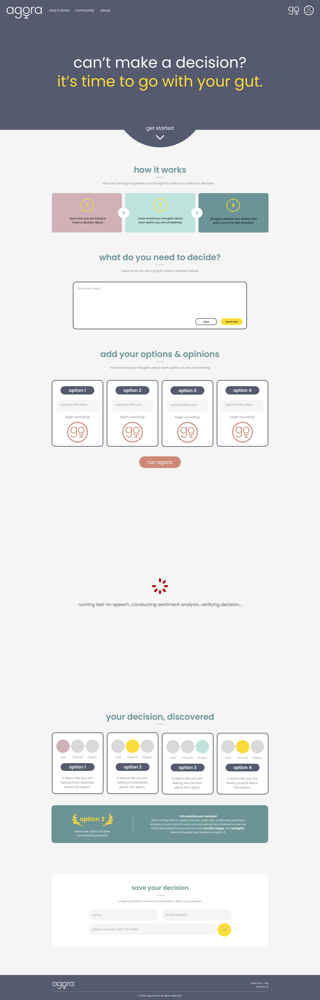

#agora - a decision making web app 

Created for HackMIT 2023 (not submitted in time due to technical problems)

### how it works:
1. input what you are trying to make a decision about
2. voice record your thoughts about each option you are considering
3. let agora analyze your speech and point you in the right direction!

### video demo: 
https://youtu.be/fxhFVNplBYM

### figma ui and design: 
